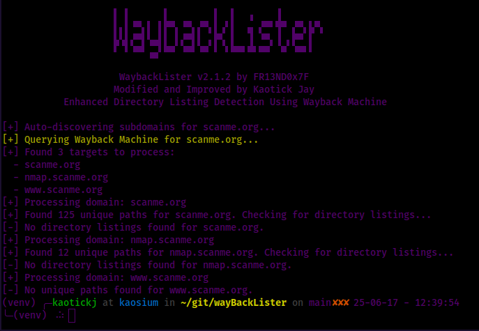

---

# WaybackLister v2.1.2

```
		    ▌ ▌      ▌        ▌  ▌  ▗    ▐       
		    ▌▖▌▝▀▖▌ ▌▛▀▖▝▀▖▞▀▖▌▗▘▌  ▄ ▞▀▘▜▀ ▞▀▖▙▀▖
   		    ▙▚▌▞▀▌▚▄▌▌ ▌▞▀▌▌ ▖▛▚ ▌  ▐ ▝▀▖▐ ▖▛▀ ▌  
		    ▘ ▘▝▀▘▗▄▘▀▀ ▝▀▘▝▀ ▘ ▘▀▀▘▀▘▀▀  ▀ ▝▀▘▘   
                                              
```

> **WaybackLister v2.1.2** — by [FR13ND0x7F]
> Modified and Improved by Kaotick Jay ([kaotickj](https://github.com/kaotickj/))  
> Enhanced Directory Listing Detection Using Wayback Machine.

---

## 🕵️‍♂️ What It Does

WaybackLister is a reconnaissance tool that taps into the Wayback Machine to fetch historical URLs for a domain, parses unique paths, and checks if any of those paths currently expose **directory listings**. It's fast, multithreaded, and built for practical use in security assessments and bug bounty recon.

---

## 🚀 Features

- Pulls archived URLs via the Wayback Machine
- Extracts unique paths and subdomains from those URLs
- Actively checks for live directory listings
- Supports multithreaded scanning
- Can auto-discover subdomains based on Wayback data
- Works with single domain or list of domains

---

## 📦 Installation

Clone the repo and you're good to go:

```bash
git clone https://github.com/kaotickj/wayBackLister.git
cd wayBackLister
pip install -r requirements.txt -> To be updated
```

---

## 🛠 Usage

### Scan a Single Domain

```bash
python waybacklister.py -d example.com
```

### Scan Multiple Domains from a File

```bash
python waybacklister.py -f domains.txt
```

### Auto-discover and Scan Subdomains [Module Under Development]

```bash
python waybacklister.py -auto example.com 
```

### Custom Thread Count

```bash
python waybacklister.py -auto scanme.org
```

---

## 📄 Example Output

```
[+] Auto-discovering subdomains for scanme.org...
[+] Querying Wayback Machine for scanme.org...
[+] Found 3 targets to process:
  - scanme.org
  - nmap.scanme.org
  - www.scanme.org
[+] Processing domain: scanme.org
[+] Found 125 unique paths for scanme.org. Checking for directory listings...
[-] No directory listings found for scanme.org.
[+] Processing domain: nmap.scanme.org
[+] Found 12 unique paths for nmap.scanme.org. Checking for directory listings...
[-] No directory listings found for nmap.scanme.org.
[+] Processing domain: www.scanme.org
[-] No unique paths found for www.scanme.org.

```

---

## 📄 Example



---

## ⚙️ Requirements

- Python 3.6+
- `requests`
- `argparse`

Install dependencies with:

```bash
pip install -r requirements.txt
```

---

## 🧠 Why This Tool?

Sometimes, old URLs archived by the Wayback Machine lead to interesting places—especially when they still work. Directory listings can reveal sensitive files, backups, or even forgotten admin panels. WaybackLister helps you find them in a systematic and scriptable way.

---

## Community Blogs/ Resources
- ([How I Use Waybacklister to Discover Gold in Bug Bounty Targets 💰](https://www.youtube.com/watch?v=N_uROnZ0q58&ab_channel=PCPLALEX))
- ([WayBackLister : Innovative Directory Bruteforcing Technique](https://systemweakness.com/waybacklister-innovative-directory-bruteforcing-technique-43535da40bc4))
- ([Recon Tool: WaybackLister](https://www.blackhatethicalhacking.com/tools/waybacklister/))

---

## 📢 Disclaimer

This tool is meant for educational and authorized security testing only. Don't use it on systems you don't have permission to test.

---

## 🙌 Acknowledgements

Crafted by FR13ND0x7F @anmolksachan — for the community, by the community.

---
